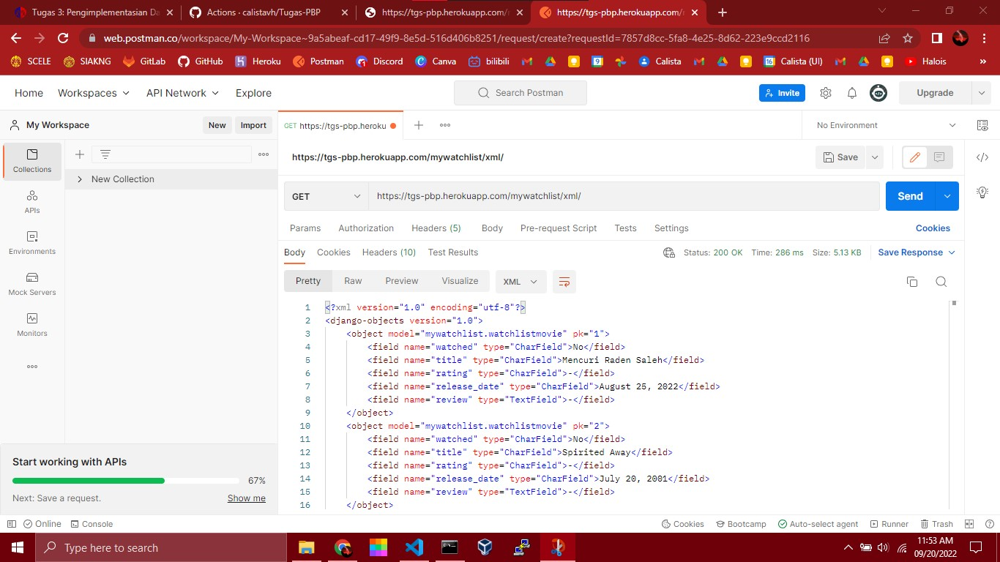
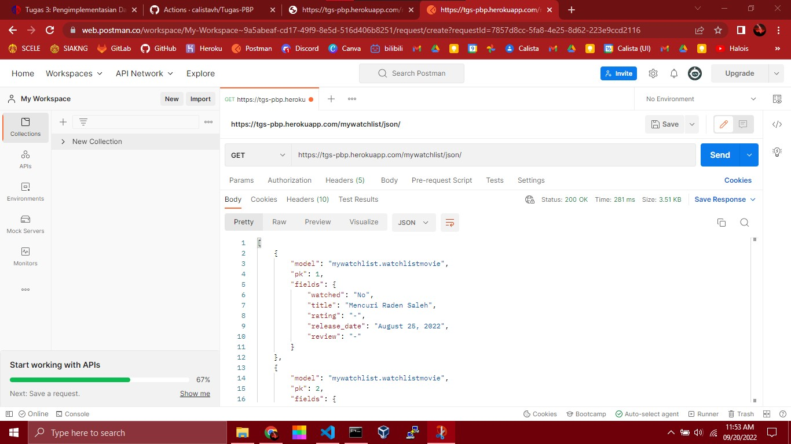

# Pemrograman Berbasis Platform - Tugas 3
Nama: Calista Vimalametta Heryadi 
NPM: 2106630473 
Kelas: C

## Link App Heroku

HTML: <https://tgs-pbp.herokuapp.com/mywatchlist/html> 
XML: <https://tgs-pbp.herokuapp.com/mywatchlist/xml> 
JSON: <https://tgs-pbp.herokuapp.com/mywatchlist/json>

## Perbedaan File HTML, XML, dan JSON

1. **HTML:**
- merupakan Markup language
- untuk menampilkan data
- menggunakan tag dengan nama yang sudah ditetapkan

2. **XML:**
- merupakan Markup language
- untuk mengirim data
- menggunakan tag dengan nama yang ditentukan sendiri

3. **JSON:**
- merupakan JavaScript language
- untuk mengirim data
- menggunakan kurung, bukan tag

## Data Delivery dalam Implementasi Platform

Data delivery diperlukan dalam mengimplementasikan suatu platform agar data dapat dikirim dari satu stack ke stack lainnya. Pengiriman data bermanfaat untuk kolaborasi, mengorganisasi data, beralih ke teknologi yang lebih baru, dan lain-lain.

## Implementasi Tugas 3

1. **cmd:** `python manage.py startapp mywatchlist`
2. **project_django/settings.py:** tambah `'mywatchlist'` di list `INSTALLED_APPS`
3. **mywatchlist/models.py:** tambah class `WatchlistMovie` berisikan field atribut-atributnya
4. **cmd:** `python manage.py makemigrations`
5. **cmd:** `python manage.py migrate`
6. **mywatchlist:** buat folder `fixtures` dan di dalamnya file `initial_mywatchlist_data.json`
7. **mywatchlist/fixtures/initial_mywatchlist_data.json:** tambah data berdasarkan model
8. **cmd:** `python manage.py loaddata initial_mywatchlist_data.json`
9. **mywatchlist:** buat folder `templates` dan di dalamnya file `mywatchlist.html`
10. **mywatchlist/templates/mywatchlist.html:** tambah tag HTML dan Django untuk menampilkan data dalam bentuk tabel
11. **mywatchlist/views.py:** tambah import dan tiga function `show_mywatchlist_html/xml/json` yang mengembalikan response sesuai file format masing-masing berisikan data
12. **mywatchlist:** buat file `urls.py`
13. **mywatchlist/urls.py:** tambah import, string `app_name`, dan list `urlpatterns` berisikan function `path` ke masing-masing function di views (html sebagai default)
14. **project_django/urls.py:** tambah function `path` ke mywatchlist di `urlpatterns`

Runserver dan buka app di localhost. Jika berhasil, push dan jalankan workflow di GitHub untuk men-deploy ke Heroku.

## Screenshot Postman

